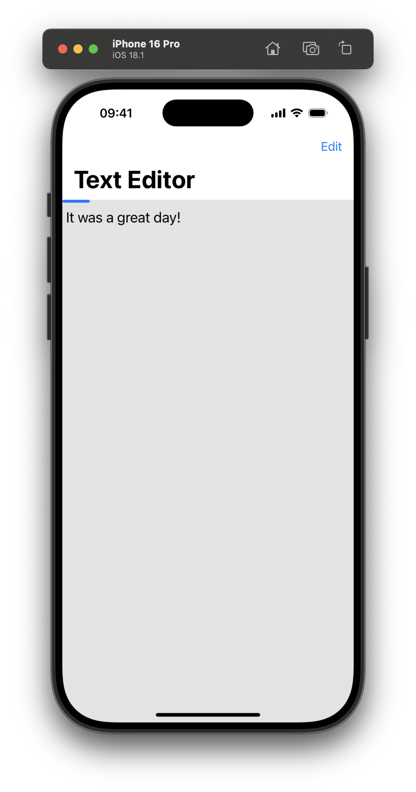
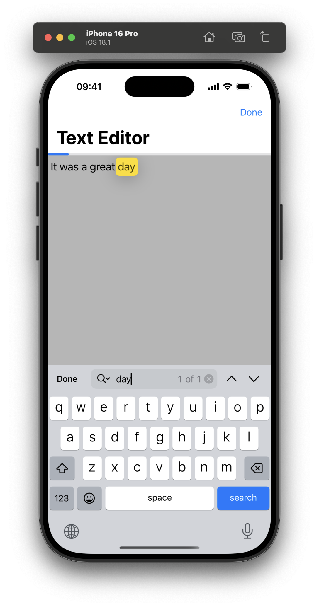

# TextEditorExample

An example project for [Using TextEditor in SwiftUI](https://www.artemnovichkov.com/blog/using-text-editor-in-swiftui) article.

  
  

## Author

Artem Novichkov, https://www.artemnovichkov.com/

## License

The project is available under the MIT license. See the [LICENSE](./LICENSE) file for more info.
